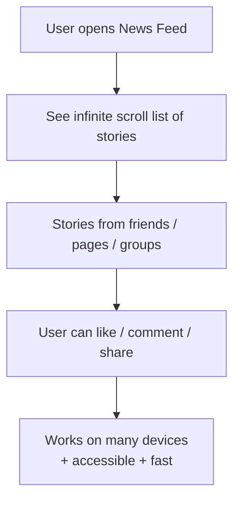

[YouTube – Facebook News Feed Frontend System Design](https://www.youtube.com/watch?v=5vyKhm2NTfw&list=PLI9W87-Dqn7j_x6QtR6sUjycJR7nQLBqT) [youtube](https://www.youtube.com/watch?v=5vyKhm2NTfw&list=PLI9W87-Dqn7j_x6QtR6sUjycJR7nQLBqT)

```md
# Facebook News Feed – Frontend System Design

[Video reference](https://www.youtube.com/watch?v=5vyKhm2NTfw&list=PLI9W87-Dqn7j_x6QtR6sUjycJR7nQLBqT)

---

## High‑level goals



---

## Component architecture

```mermaid
flowchart TD
    App[App Shell] --> Header[Header / Nav]
    App --> NewsFeed[NewsFeed]
    NewsFeed --> StoryList[Story List]
    StoryList --> Story[Story Item]:::c
    Story --> StoryCard[Story Card<br/>(avatar, title, text, media, actions)]
    Story --> CommentList[Comment List]
    Story --> CommentInput[Comment Input]
    CommentList --> Comment[Comment]
    
    classDef c fill=#eef,stroke=#336,stroke-width=1px;
```

- News feed is a list of story components; each story contains card, comments list, and comment input.[attached_file:1]  
- Dependencies follow a top‑down tree so data flows from NewsFeed into stories and then into subcomponents.[attached_file:1]

---

## Data entities

```mermaid
flowchart TD
    Story[(Story)]
    Comment[(Comment)]
    Media[(Media)]
    Origin[(Origin: user/page/group)]

    Story -->|originId| Origin
    Story -->|commentIds[]| Comment
    Story -->|mediaIds[]| Media

    Comment -->|authorId| Origin
    Comment -->|mediaIds[]| Media
```

- Story: `id, content, date(timestamp), originId, mediaIds[], commentIds[]`.[attached_file:1]  
- Comment: `id, content, date, authorId, mediaIds[]`; Media: `type (image/video/link), url`.[attached_file:1]

---

## API and pagination / live updates

```mermaid
flowchart TD
    Client[NewsFeed component] -->|GET /posts?userId&cursor&pageSize&excludeComments|minId| API[(REST API)]
    Client -->|POST /posts| API
    Client -->|POST /comments| API

    Client -->|Subscribe SSE<br/>(/posts/subscribe)| SSE[Server‑Sent Events]

    SSE --> Client
```

- Main endpoint: `GET /posts` with cursor/timestamp + page size for scrolling; POST endpoints for creating posts and comments.[attached_file:1]  
- For new stories while scrolling, client subscribes to server‑sent events instead of heavy long‑polling or WebSockets.[attached_file:1]

---

## Frontend data store (normalized)

```mermaid
flowchart TD
    Store[(Frontend Store)]
    Store --> Feeds[feedsById: {feedId -> storyIds[]}]
    Store --> Stories[storiesById: {storyId -> Story}]
    Store --> Comments[commentsById: {commentId -> Comment}]
    Store --> Origins[originsById: {originId -> user/page/group}]
    Store --> Media[mediaById: {mediaId -> Media}]
```

- Store is flattened and indexed by IDs to give fast lookups when rendering nested components.[attached_file:1]  
- NewsFeed passes only IDs down; each component pulls its slice from the store by ID.[attached_file:1]

---

## Infinite scroll + windowing

```mermaid
flowchart TD
    subgraph Viewport[Viewport]
        Visible[Visible Stories Window<br/>(e.g., 10 items)]
    end

    Visible --> BottomSentinel[Bottom Sentinel]
    Visible --> TopSentinel[Top Sentinel]

    BottomSentinel -->|intersect| LoadMore[Fetch next page<br/>(cursor/pageSize)]
    LoadMore --> UpdateStore[Append story IDs in store]

    TopSentinel -->|scroll up beyond top| ShiftWindow[Shift window up<br/>reuse DOM nodes]

    Viewport -->|always render fixed count<br/>e.g. 10–20 rows| DOM[Limited DOM nodes]
```

- IntersectionObserver tracks top/bottom sentinels to trigger loading more data and shifting the window.[attached_file:1]  
- Only a fixed number of story components remain in the DOM; data outside the window lives in the store, not as DOM nodes.[attached_file:1]

---

## Performance & optimization

```mermaid
flowchart TD
    Perf[Performance] --> Net[Network]
    Perf --> Render[Rendering]
    Perf --> JS[JavaScript]

    Net --> Assets[Compress & cache assets<br/>(gzip/brotli, CDN)]
    Net --> Images[Responsive images service<br/>+ lazy load]
    Net --> H2[Use HTTP/2<br/>multiplexing + bundle splitting]

    Render --> SSR[SSR for initial feed<br/>+ inline critical CSS/JS]
    Render --> Lazy[Lazy load non‑critical parts]

    JS --> Less[Do less work<br/>avoid heavy sync loops]
    JS --> Workers[Use Web Workers / caching<br/>for heavy tasks]
```

- Network: compression, modern image formats, image service + CDN, HTTP/2, bundle splitting.[attached_file:1][web:58]  
- Rendering/JS: SSR for first paint, lazy loading, minimal synchronous JS, offload heavy work to workers and caching.[attached_file:1][web:46]

---

## Accessibility

```mermaid
flowchart TD
    A11y[Accessibility] --> Colors[Color‑blind friendly themes]
    A11y --> ARIA[ARIA roles & live regions<br/>for dynamic updates]
    A11y --> Alt[Alt text for media]
    A11y --> Keys[Keyboard shortcuts<br/>(new post, scroll, focus)]
```

- Support screen readers with ARIA/live regions and alt text; ensure color contrast; provide keyboard shortcuts for key actions.[attached_file:1][web:33]
```