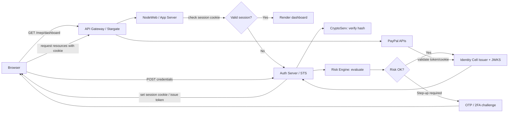

# paypal-auth-flow.md

> **User's close-to-correct impl note (verbatim)**  
> so I write paypal.com/mep/dashboard  
> a login screen appears  
> then what -> AS recieves some clinet_id from localstoreahe browser, and checks if his session is on or not, if not, redirectets to /authorize  
> once user puts something, thats passed as opqque value to AS which calls db, check is username==user entered one, and pwd_encrypted==db enc pwd,if yes, then show success and paralley check with risk  
> if successm hes sent to /mep/dashbar with an access token from somewhere  
> is this right ?

---

# PayPal Authentication — brief implementation doc (plain English)

This document describes the real-world PayPal-style web/native authentication flow in simple language, and lists the components involved in each step. It starts by acknowledging your note above and then corrects and completes it.

---

## Short answer to your original note
You were mostly on the right track. The key corrections:
- `client_id` is **not usually read from localStorage**. It’s an application/integration identifier configured server-side. The browser carries **session cookies** or receives a redirect/code during login.
- Credentials are validated by **hashing** the submitted password and comparing it to the stored hash (handled by a credential service), not by raw encrypted==encrypted comparison.
- The **risk check** and **token issuance** happen in the auth step and can force an extra challenge (step-up) before tokens/sessions are granted.
- Tokens (access/ID/refresh/device) are issued by the **Authorization Server (AS / STS)** and later validated by services with JWKS or local introspection.

---

## One-line summary
When you hit `paypal.com/mep/dashboard` the system either uses your existing session cookie to render the dashboard, or directs you to the Authorization Server (AS) for login. The AS validates credentials, runs a risk check (may require step-up), and then issues tokens or a session cookie which the site uses for API calls.

---

## Actors & components (quick)
- **Browser / Mobile App / Partner (RP)** — the client initiating the request.
- **API Gateway (APPS / Stargate)** — routes incoming traffic.
- **NodeWeb / App Server** — PayPal web frontend that renders pages and orchestrates web flows.
- **Authorization Server (AS) / STS** — validates credentials, consults risk, and issues tokens.
- **CryptoServ / Credential Service** — securely verifies password hashes and other credentials.
- **Risk Engine** — scores risk and decides on step-ups (MFA).
- **Device Management / Auth SDK** — handles device-bound keys, LLS (Long-Lived Sessions) for native apps.
- **Identity Cell (Issuer + JWKS + KMS)** — regional token issuer and key store used to sign tokens and publish JWKS.
- **PayPal Services / APIs** — resource servers that validate tokens and serve data.
- **Token cache / Mayfly** — performance caching layer for tokens.

---

## Step-by-step flow (plain English) — with components

### 1) Request dashboard
- **Action:** User types `paypal.com/mep/dashboard` and browser sends a GET.
- **Components:** Browser → API Gateway → NodeWeb.
- **What happens:** NodeWeb checks your **session cookie**. If valid, it renders the dashboard (no login required).

### 2) No valid session → redirect to login
- **Action:** NodeWeb redirects browser to login (AS login UI) or renders a login page.
- **Components:** NodeWeb → AS / NodeWeb login UI.
- **Note:** For first-party PayPal the login UI is typically hosted by PayPal; for third-party/partner flows, the partner backend might have pushed the full auth request to the AS first (PAR), receiving a `request_uri` that the browser will use.

### 3) User submits credentials (or passkey/biometric)
- **Action:** Browser POSTs credentials (TLS). For native apps, the SDK might send a device proof instead of a password.
- **Components:** Browser → AS; native: Auth SDK → AS / Device secure enclave.
- **What happens:** Credentials are received securely by the AS.

### 4) Credential validation & risk check
- **Action:** AS validates credentials and consults risk.
- **Components:** AS → CryptoServ (password hash check) → Device Management → Risk Engine.
- **What happens:**
  - Passwords are checked by hashing + comparing to stored hash (not raw equality).
  - AS uses device info and risk signals. If suspicious, AS triggers **step-up** (e.g., OTP, 2FA).
  - Step-up must succeed before issuing high-privilege tokens.

### 5) Token / session issuance
- **Action:** On successful auth + risk, the AS issues tokens or sets a secure session cookie.
- **Components:** AS / STS → Identity Cell (signing via KMS & JWKS).
- **What is returned:**
  - **First-party (paypal.com):** server often sets a secure session cookie; the server then uses access tokens for API calls behind the scenes.
  - **Partner / OIDC flow:** AS returns an authorization code to the browser. The partner backend then exchanges the code at `/token` for `access_token`, `id_token`, `refresh_token`.
- **Notes:** Tokens are signed (JWT) or opaque with a routing prefix. Identity Cells publish JWKS so services can verify tokens locally.

### 6) Use tokens to call APIs
- **Action:** Browser or backend calls PayPal APIs with access token (or the browser uses session cookie).
- **Components:** API Gateway → Services → Identity Cell (for JWKS / introspection if needed).
- **What happens:** Services verify token signatures (via JWKS) or introspect opaque tokens; if valid and scopes permit, the API returns data.

### 7) Refresh / rotation / revocation
- **Action:** Access tokens expire; backends use refresh tokens to get new access tokens via `/token`.
- **Components:** Client backend → AS; AS → token rotation / revocation endpoint.
- **What happens:** AS validates refresh token, may re-run risk checks, issues new tokens, and supports token revocation if needed.

### 8) Native LLS (device-backed) — shorter flow
- **Action:** Native app uses device private key (secure enclave) to sign challenge; Auth SDK presents proof to AS.
- **Components:** Device secure enclave → Auth SDK → AS → Device Management & Risk.
- **What happens:** If valid, AS issues a **device/LLS token**; SDK uses that to obtain short-lived access tokens without password prompts.

---

## Short definitions (plain)
- **AS (Authorization Server / STS):** The service that authenticates users/devices and issues access/id/refresh/device tokens.
- **PAR (Pushed Authorization Requests):** Backend pushes the full auth request to AS and gets back a short `request_uri` the browser uses; avoids exposing sensitive params in the URL.
- **PKCE:** An extra proof (`code_challenge` / `code_verifier`) that ties an authorization code to the client that started the flow (prevents stolen-code attacks).

---

## Diagram (Mermaid — pasteable)

### First-party PayPal flow

