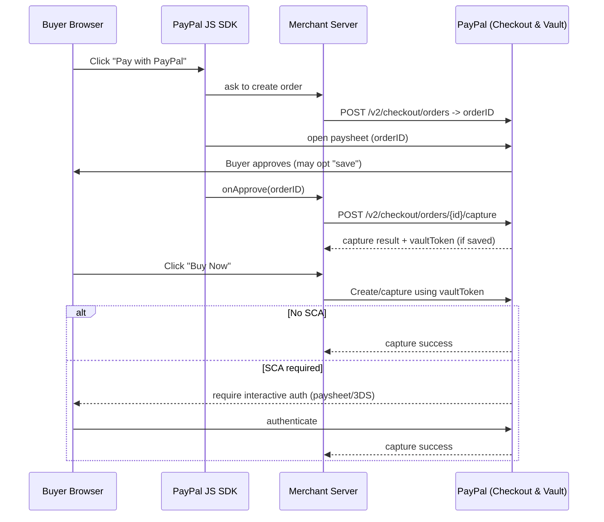

# Vault & One-Click Payments — High Level

**Purpose (one line)**  
Explain how PayPal enables one-click / merchant-initiated payments while ensuring merchants never store card PANs.

---

## Key ideas (brief)
- **Tokenization & vault:** PayPal collects sensitive payment instruments (card PAN or PayPal account) **inside PayPal’s PCI-compliant vault** and returns an **opaque token** (vault token / billing agreement id) to the merchant. The merchant stores only that token and uses it for later charges; PayPal maps token → actual instrument internally. :contentReference[oaicite:0]{index=0}
- **Vault flows:** Two common patterns: *vault-with-purchase* (save while charging) and *vault-without-purchase* (Billing Without Purchase / BWP). PayPal provides consent UX and issues tokens accordingly. :contentReference[oaicite:1]{index=1}

---

## Minimal functional flow (text)

### First purchase + vault (buyer consents)
1. Merchant page loads **PayPal JS SDK** and shows PayPal button.
2. Buyer clicks → merchant (server) **creates an order** with PayPal (`/v2/checkout/orders`) → returns `orderID`.
3. PayPal opens paysheet → buyer logs in / enters card and *opts to save for later*.
4. Merchant server **captures** the order (`/v2/checkout/orders/{id}/capture`). PayPal returns capture result **and** (if chosen) a **vault token** (or billing agreement id). Merchant stores token mapped to their customer id.
5. Merchant fulfills order. Webhooks confirm capture/settlement.

### Later: one-click (merchant-initiated)
1. Buyer clicks “Buy Now” (merchant recognizes buyer).
2. Merchant server creates & captures payment server→server using stored **vault token**.
3. PayPal runs risk/SCA evaluation: if OK → capture success; if not → request interactive step-up (paysheet / 3DS) or decline.
4. Merchant fulfills on success; handle fallbacks for declines.

## Simple Mermaid diagram

